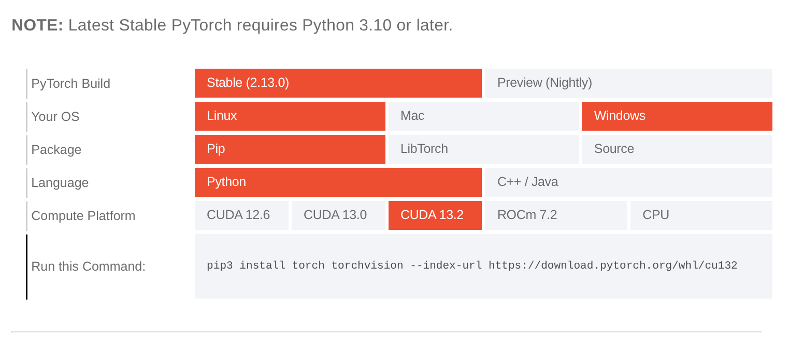
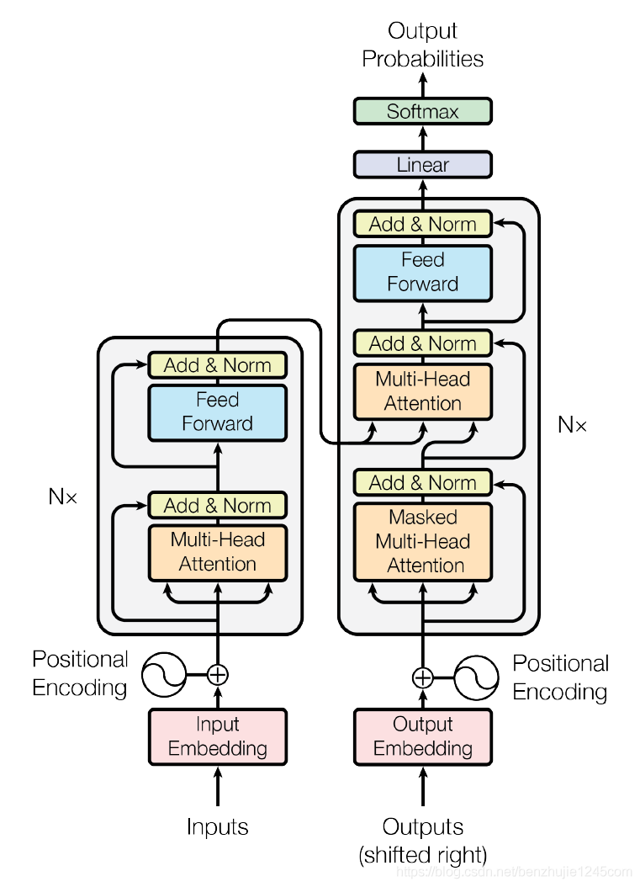

## 环境准备

### 安装uv

本文使用uv包管理工具，github地址:`https://github.com/astral-sh/uv`

安装完成后新建文件夹，在文件夹位置运行：
```sh
uv init
```
来初始化项目

### 安装pytorch

首先查看cuda版本
```sh
nvidia-smi
```
然后到官网`https://pytorch.org/get-started/locally/`上选择小于等于你的cuda版本



这里我的cuda版本为13.3，应该选择13.2版本，图中命令为：

```sh
pip3 install torch torchvision --index-url https://download.pytorch.org/whl/cu132
```

使用uv安装应改为

```sh
uv add torch torchvision --default-index https://download.pytorch.org/whl/cu132
```

在`main.py`里写入

```python
import torch

print(torch.__version__)
print(torch.cuda.is_available())
```

运行`uv run main.py`

正常输出：

```sh
2.13.0+cu132
True
```

## transformer简介

先看完整架构图


